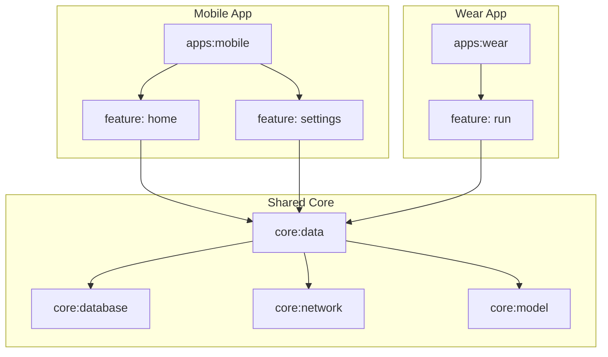

Here is the updated **ARCHITECTURE.md** reflecting your specific structure where feature modules are nested under their respective platforms (`mobile` and `wear`).

---

# 🏗️ Project Architecture & File Structure

This repository follows a modern, **multi-module Android architecture** designed to support both **Mobile** and **Wear OS** applications. It enforces strict separation between platform-specific UI (Mobile vs. Wear) while sharing the "Brain" (Core Logic).

## 📂 High-Level Structure

The project is organized into three distinct layers:

1. **Apps (`:apps`)**: The executable "Shells" for Mobile and Wear.
2. **Platform Features**: UI modules nested *under* their specific app (e.g., `:apps:mobile:features:home`).
3. **Core (`:core`)**: Shared libraries containing business logic, data storage, and domain models used by both platforms.

```text
ProBase/
├── applications/
│   └── ashbike/
│       ├── apps/
│       │   ├── mobile/                    # 📱 PHONE APP ROOT
│       │   │   ├── build.gradle.kts       # Shell Module
│       │   │   └── features/              # (Folder for Mobile Features)
│       │   │       ├── home/              # :apps:mobile:features:home
│       │   │       ├── settings/          # :apps:mobile:features:settings
│       │   │       └── trips/             # :apps:mobile:features:trips
│       │   │
│       │   └── wear/                      # ⌚ WATCH APP ROOT
│       │       ├── build.gradle.kts       # Shell Module
│       │       └── features/              # (Folder for Watch Features)
│       │           └── run/               # :apps:wear:features:run
│       │
│       └── database/                      # Shared DB config
│
├── core/                                  # 🧠 SHARED BRAIN
│   ├── data/                              # Repositories & Service Managers
│   ├── database/                          # Room Database, Entities, DAOs
│   ├── network/                           # API Clients, DTOs
│   ├── model/                             # Shared Data Classes
│   └── ui/                                # Shared Design (Theme, Type)
│
└── build-logic/                           # 🐘 Gradle Convention Plugins

```

---

## 📱 Mobile Architecture (`:apps:mobile`)

The mobile application is composed of a "Shell" and several isolated "Feature Modules".

### The Shell

**Namespace:** `com.zoewave.ashbike.mobile`

* Contains `MainActivity`, `AshBikeApp` (Hilt), and `AndroidManifest.xml`.
* Its only job is to load the `NavHost` and stitch the features together.

### Mobile Features

Located in: `applications/ashbike/apps/mobile/features/`
These modules contain **Jetpack Compose (Material 3)** UI and ViewModels.

| Module | Logic | Description |
| --- | --- | --- |
| **`:home`** | `HomeRoute`, `HomeViewModel` | The main dashboard. Displays Speed, Map, and active Ride controls. |
| **`:settings`** | `SettingsRoute`, `SettingsViewModel` | User preferences, Profile editing, and Configuration. |
| **`:trips`** | `TripsRoute`, `TripsViewModel` | History of past rides, statistics, and details. |

---

## ⌚ Wear Architecture (`:apps:wear`)

The watch application is architected similarly but uses **Wear Compose**.

### The Shell

**Namespace:** `com.zoewave.ashbike.wear`

* Contains `WearActivity` and `AshBikeWearApp`.

### Wear Features

Located in: `applications/ashbike/apps/wear/features/`

| Module | Logic | Description |
| --- | --- | --- |
| **`:run`** | `RunRoute`, `RunViewModel` | The active workout screen. Large text, big buttons, heart rate monitor. |

---

## 🧠 Core Layer (`:core`)

These modules are **pure logic** and **data handling**. They are shared between Mobile and Wear to ensure consistent behavior.

| Module | Components | Responsibilities |
| --- | --- | --- |
| **`:core:model`** | `BikeRideInfo`, `WeatherInfo` | **The Language.** Pure Kotlin data classes used across the entire app. No logic. |
| **`:core:database`** | `AppDatabase`, `RideDao` | **The Pantry.** Handles local storage using Room. |
| **`:core:network`** | `WeatherApi`, `RideService` | **The Supplier.** Handles remote communication (Retrofit/Apollo). |
| **`:core:data`** | `BikeRepository`, `ServiceManager` | **The Chef.** It coordinates data. It decides whether to fetch from Network or Database. |

---

## 🔌 Dependency Flow

The architecture enforces strict isolation. Mobile features cannot see Watch features, and Features cannot see each other.



---

## 📦 Package Naming Convention

To keep imports clean, we omit organizational folders (like `features`) from the package namespace.

**Example: Mobile Home Feature**

* **Folder:** `apps/mobile/features/home`
* **Gradle Module:** `:apps:mobile:features:home`
* **Package Name:** `com.zoewave.ashbike.mobile.home`

**Example: Wear Run Feature**

* **Folder:** `apps/wear/features/run`
* **Gradle Module:** `:apps:wear:features:run`
* **Package Name:** `com.zoewave.ashbike.wear.run`