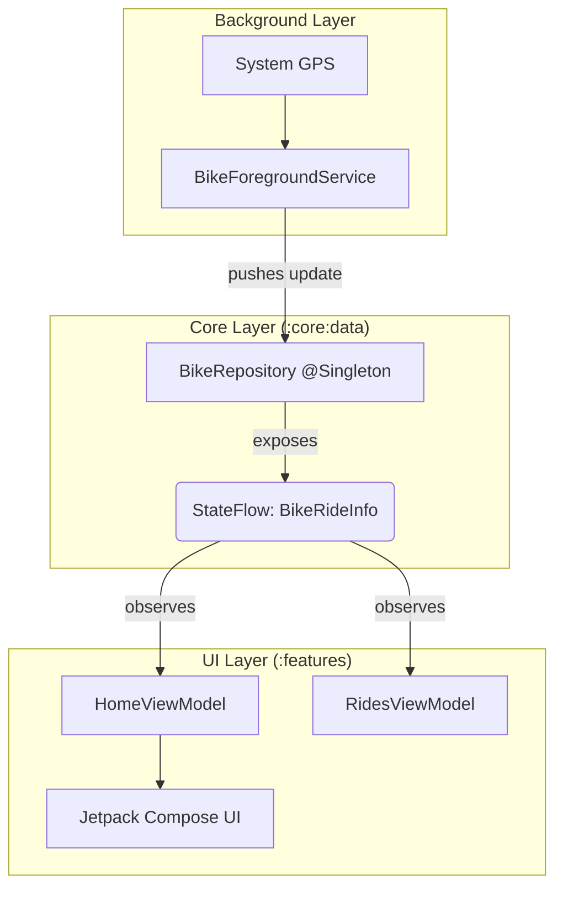

# 🏗️ AshBike Architecture & Engineering Guide

This repository follows a strict **Multi-Module Clean Architecture** designed to support **Mobile** and **Wear OS** platforms from a single codebase. It leverages the latest Android standards, including **Navigation 3**, **Jetpack Compose**, and **Hilt**.

---

## 📂 1. High-Level File Structure

We organize modules by **Platform** first, then by **Logic**. Features are physically nested under their parent application to enforce organization, but they remain fully isolated Gradle modules.

```text
applications/
└── ashbike/
    ├── apps/
    │   ├── mobile/                    # 📱 PHONE APP ROOT
    │   │   ├── build.gradle.kts       # Shell Module (The Entry Point)
    │   │   │
    │   │   └── features/              # 📂 Container for Mobile Screens
    │   │       ├── home/              # 📦 Module: :apps:mobile:features:home
    │   │       ├── rides/             # 📦 Module: :apps:mobile:features:rides
    │   │       └── settings/          # 📦 Module: :apps:mobile:features:settings
    │   │
    │   └── wear/                      # ⌚ WATCH APP ROOT
    │       ├── build.gradle.kts       # Shell Module
    │       └── features/              # 📂 Container for Watch Screens
    │           └── run/               # 📦 Module: :apps:wear:features:run
    │
    └── database/                      # Shared Database Config
    
core/                                  # 🧠 SHARED BRAIN (The Logic Layer)
    ├── data/                          # Repositories & Service Managers
    ├── database/                      # Room Entities & DAOs
    ├── network/                       # Retrofit Clients
    ├── model/                         # Pure Data Classes (The Common Language)
    └── ui/                            # Design System (Theme, Typography, Icons)

```

---

## 🧭 2. Navigation Architecture (Navigation 3)

We use **Android Navigation 3 (`androidx.navigation3`)**. Unlike traditional Navigation (Nav2), we do **not** use a graph builder or XML. We own the Back Stack directly.

### Core Concepts

1. **The Back Stack**: A simple `MutableList<T>` that we manage manually. It is the "Source of Truth."
2. **NavDisplay**: A Composable that observes the list and renders the *last* item.
3. **Type-Safety**: We do not use strings. We use Kotlin Serialization objects.

### Implementation Pattern

**Location:** `AshBikeMainScreen.kt`

```kotlin
// 1. Define the Stack
val backStack = remember { mutableStateListOf(AshBikeDestination.Home) }

// 2. Observe Changes (Optimized)
val currentDestination by remember { derivedStateOf { backStack.lastOrNull() } }

// 3. Render
NavDisplay(
    backStack = backStack,
    onBack = { backStack.removeLastOrNull() },
    entryProvider = { key ->
        NavEntry(key) {
            when (key) {
                is AshBikeDestination.Home -> HomeRoute(...)
                is AshBikeDestination.Settings -> SettingsRoute(...)
            }
        }
    }
)

```

---

## 📡 3. Data Flow ( The "Radio Station" Pattern)

We use a **Unidirectional Data Flow** driven by a Background Service. Feature modules (Home, Rides) do **not** talk to the Service directly. They observe a **Singleton Repository**.

### The Flow

1. **The Source (DJ):** `BikeForegroundService` runs in the background. It gets raw GPS/Sensor data.
2. **The Channel (Antenna):** `BikeRepository` (Singleton) receives the data and updates a `StateFlow`.
3. **The Consumer (Radio):** `HomeViewModel` observes `repository.rideInfo` and converts it to UI State.



### Service Lifecycle

The `MainViewModel` (in the App Shell) is responsible for the Service Lifecycle.

* **App Start:** `DisposableEffect` calls `bindService()`.
* **Permissions:** When Location is granted, `MainViewModel` sends `ACTION_REFRESH_GPS`.
* **App Close:** `onDispose` calls `unbindService()`.

---

## 🛠️ 4. Module Responsibilities

| Module Type | Responsibilities | Dependencies |
| --- | --- | --- |
| **App Shell**<br>

<br>`:apps:mobile` | `MainActivity`, Hilt Setup, `NavDisplay`, Service Binding, Permissions. | Depends on ALL Feature modules. |
| **Feature**<br>

<br>`:apps:mobile:features:home` | **UI Only.** ViewModels, Compose Screens. Displays data, captures user input. | Depends on `:core:data`, `:core:model`. **Never depends on other features.** |
| **Core Data**<br>

<br>`:core:data` | **Business Logic.** Repositories, Service Manager, Data Aggregation. | Depends on `:core:database`, `:core:network`. |
| **Core Model**<br>

<br>`:core:model` | **Data Structures.** Pure Kotlin classes (POJOs). | No dependencies. |

---

## 🚀 5. How to Add a New Feature

1. **Create Module:**
* Create directory: `applications/ashbike/apps/mobile/features/newfeature`
* Add `build.gradle.kts` (Use convention plugins).


2. **Register Module:**
* Add `include(":apps:mobile:features:newfeature")` to `settings.gradle.kts`.


3. **Define Route:**
* Add `@Serializable data object NewFeature` to `AshBikeDestination.kt`.


4. **Connect UI:**
* Add dependency in `apps/mobile/build.gradle.kts`.
* Add a `when(key)` case in `AshBikeMainScreen`'s `NavDisplay` block.