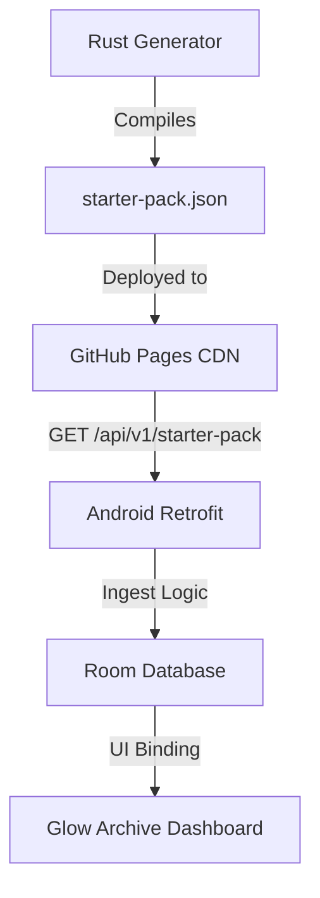

# Documentation: Glow Archive Backend & Taxonomy Architecture

This document details the offline-first, distributed architecture of the KoColor inventory system and its alignment with the **Professional Glow Archive Taxonomy**.

---

## 🏗️ Architectural Vision

The KoColor backend is built on a **"Static-First" distributed philosophy**. This ensures the mobile app remains highly performant, costs zero to host for metadata, and functions perfectly in low-connectivity environments.

### The Three Pillars of Data
1.  **Static Metadata CDN (GitHub Pages)**: Hosts the `starter-pack.json` and high-resolution assets (.webp swatches). Provides instant delivery with zero cold-start latency.
2.  **Dynamic Intelligence Node (Hugging Face)**: A Rust-based Axum server that handles heavy-lifting AI tasks (LLM narratives, multimodal analysis) on-demand.
3.  **Local Source of Truth (Android Room)**: The mobile device is the primary database. Network data is ingested, cached, and persisted locally to ensure 100% offline autonomy.

---

## 🟢 The Professional Taxonomy

We have implemented a rigorous three-tier classification system to ensure algorithmic synergy across the platform.

### Level 1: Macro Categories (The UI Layer)
Intuitive buckets for body-zone mapping: `Skincare & Prep`, `Complexion`, `Color & Dimension`, `Eyes & Brows`, `Lips`, `Nails`, etc.

### Level 2: Micro Categories (The Product Layer)
Specific technical formats: `Foundation`, `Lipstick`, `Serum`, `Contour`, etc.

### Level 3: Professional Facets (The Engine Layer)
Data points used by the AI engine for compatibility and styling calculations:
*   **Formulation**: Liquid, Cream, Powder, Gel, Balm, etc.
*   **Chemistry Base**: Water, Silicone, Oil, Alcohol, Wax. (Used to prevent product pilling).
*   **Finish**: Matte, Satin, Radiant, Dewy, Metallic, etc.
*   **Coverage**: Sheer, Light, Medium, Full, Buildable.
*   **Temperature**: Warm, Cool, Neutral, Olive. (Critical for seasonal color harmony).

---

## 🛠️ Implementation Details

### 1. Data Models & Type Safety (Android)
The `CosmeticItem` (core:model) and `CosmeticItemEntity` (kocolor:db) are now 100% aligned.
*   **New Facet**: Introduced the `Temperature` enum.
*   **Serialization**: Uses `@Serializable` (Kotlinx Serialization) for both network DTOs and local persistence.
*   **Persistence**: `FashionConverters` handles the mapping of technical enums into Room-compatible strings.

### 2. Ingestion Pipeline
The app features a robust ingestion engine in `CosmeticInventoryRepositoryImpl`:
*   **Retrofit Integration**: `KocolorApiService` fetches the payload from the static CDN.
*   **Safe Mapping**: Uses defensive parsing with `try-catch` blocks to map API strings to strictly-typed enums. 
*   **Fallbacks**: Unrecognized backend values automatically default to `UNKNOWN` or `OTHER`, preventing app crashes while maintaining data integrity.

### 3. Rust Payload Generator
The `server/kocolor/src/bin/generate_payload.rs` tool is the source of truth for the starter pack.
*   **Versioned Output**: Produces `starter-pack.json` with a schema-version field.
*   **Taxonomy Seeding**: Programmatically applies all Level 3 facets to initial product entries.

---

## 📡 Data Flow Diagram

---

## ✅ Current Status
*   **Schema Parity**: ACHIEVED (Rust <-> Android)
*   **Ingestion Pipeline**: ACTIVE
*   **Offline Support**: VERIFIED
