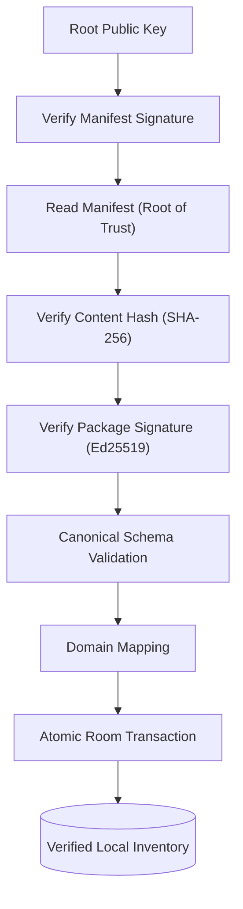
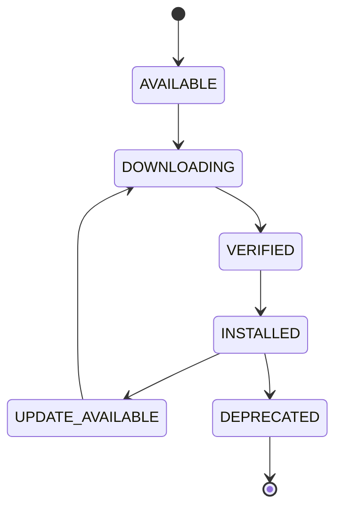

# Architecture Overview - Secure Package Distribution Platform

The KoColor platform distributes structured content through a secure, package-oriented architecture. External product data is normalized, authenticated, versioned, and delivered as canonical KoColor packages, allowing client applications to consume trusted content without depending on vendor-specific schemas.

## Core Design Principles

### 1. Canonical Data Layer
> [!IMPORTANT]
> **The Canonical Model Rule**: All external product data is normalized into the Canonical KoColor Schema before distribution. Client applications consume only the Canonical KoColor Schema and never depend on vendor-specific formats (Shopify, Sephora, etc.).
> This ensures that the mobile app remains untouched even if a vendor changes their API or JSON structure.

### 2. Deterministic Processing
> **Principle**: Given identical source data and the same compiler version, the Rust Normalization Compiler must always generate identical canonical packages. This deterministic build process ensures reproducible package hashes, stable digital signatures, and predictable client behavior across all supported platforms.

## 1. Multi-Layer Trust Framework

### Root of Trust
The signed `manifest.json` serves as the **Root of Trust** for the entire package ecosystem. Every package referenced by the manifest is independently verified before installation.

### Verification Sequence
1. **SHA-256 Validation**: Transmission integrity is checked instantly to detect corruption.
2. **Ed25519 Signature Verification**: Cryptographic proof of authenticity from the publisher.
3. **Canonical Schema Validation**: Structural integrity check against the expected DTO version.
4. **Domain Mapping**: Transformation of verified DTOs into application domain models.
5. **Atomic Room Transaction**: All-or-nothing persistence to the local database.

### Trust Chain Visualization

## 2. Package Lifecycle & Provenance

### State Machine
The platform manages packages through a defined set of states and transitions:

### Granular Provenance
Every item records its full "Ancestry" via a rich `@Embedded Provenance` object. **Provenance is immutable after installation**, ensuring a verifiable audit trail for:
- **Immutable Identity**: Reverse-DNS style IDs (e.g., `com.kocolor.pack.mac.core`).
- **Versioning**: Explicit split between `packageVersion` (content) and `schemaVersion` (structure).
- **Verification Trust**: Enforced `VerificationState` enum (VERIFIED, FAILED, LEGACY).

## 3. Technical Details

- **Architecture Style**: Static-First, Package-Oriented, Local-First Architecture.
- **Package Generation**: Rust-based Normalization Compiler producing deterministic canonical packages.
- **Security**: Dual-layered verification pipeline (Hash + Ed25519 Signatures).
- **Trust Model**: Manifest-as-root-of-trust with independent package verification.
- **Data Model**: Generic `SignedPayloadEnvelope<T>` supporting typed, versioned payloads.
- **Error Handling**: Specialized `PackException` hierarchy for precise diagnostic reporting.

## 4. Architectural Invariants

*   Vendor-specific schemas never enter the client.
*   Every package must be authenticated before installation.
*   Provenance is immutable after persistence.
*   Client applications consume only canonical models.
*   Repository operations are transactional.
*   Package identifiers are globally unique and immutable.
*   Schema evolution never breaks existing clients.

## Summary

These architectural building blocks elevate KoColor beyond a traditional inventory application. The platform now provides a reusable package distribution system capable of delivering authenticated, versioned, and verifiable content across fashion, cosmetics, wellness, AI content packages, and future client applications and digital experiences. Because every package conforms to the Canonical KoColor Schema, new content types can be introduced without changing the core application architecture.
