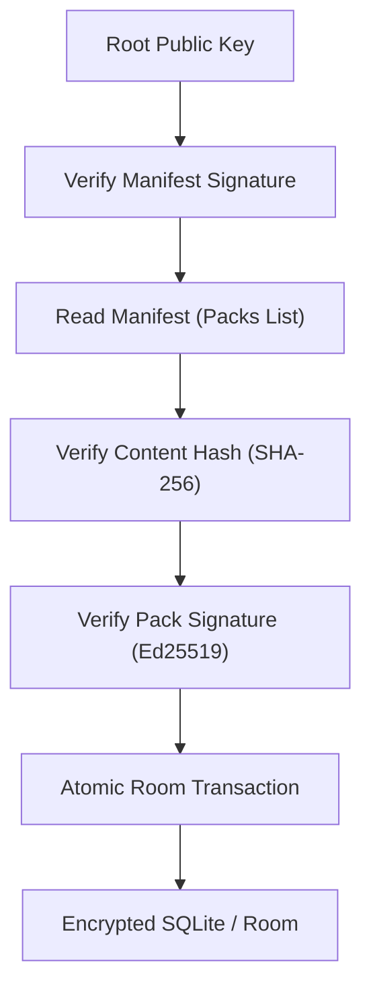

# Implementation Plan - Secure Package Management & Knowledge Platform

Upgrade the KoColor data ecosystem from a simple inventory sync to a secure, decentralized package management system. This plan establishes a "Static-First" architecture where the backend acts as a normalization compiler and the Android client serves as a high-performance, verified runtime.

## Architectural Principles

> [!IMPORTANT]
> **Canonical Model Rule**: All external product data is transformed into the canonical KoColor schema before distribution. Mobile clients never consume vendor-specific formats directly.
> Every package is normalized, versioned, digitally signed, and validated prior to installation, ensuring a deterministic, secure, and platform-independent data pipeline.

### Trust Verification Flow

## User Review Required

- **Reverse-DNS Identifiers**: Transitioning pack IDs to immutable strings (e.g., `com.kocolor.pack.mac.core`) to ensure identity persistence even if display names change.
- **Atomicity**: Enforcing Room `@Transaction` blocks for all import operations to prevent partial or corrupted package installations.
- **Schema Evolution**: Using `packageVersion` (content) and `schemaVersion` (structure) to protect against runtime DTO evolution.

## Proposed Changes

### [Data Layer - Room Database]

#### [MODIFY] [Provenance.kt](file:///Users/developer/AndroidStudioProjects/ProBase/applications/kocolor/db/src/main/java/com/zoewave/probase/kocolor/db/entity/Provenance.kt)
- Add `VerificationState` enum: `VERIFIED`, `FAILED`, `UNKNOWN`, `LEGACY`.
- Update `Provenance` fields: `packId` (Reverse-DNS), `packageVersion`, `schemaVersion`, `publisher`, `installedAtTimestamp`, `verificationState`.

#### [MODIFY] [CosmeticItemEntity.kt](file:///Users/developer/AndroidStudioProjects/ProBase/applications/kocolor/db/src/main/java/com/zoewave/probase/kocolor/db/entity/CosmeticItemEntity.kt)
- Ensure `@Embedded val provenance: Provenance?` is correctly indexed for clean wiping by `packId`.

#### [NEW] [PackStatus.kt]
- Expand lifecycle states: `AVAILABLE`, `DOWNLOADING`, `VERIFIED`, `INSTALLED`, `UPDATE_AVAILABLE`, `DEPRECATED`, `REMOVED`.

---

### [Data Layer - Network & DTOs]

#### [MODIFY] [SignedPayloadEnvelope.kt](file:///Users/developer/AndroidStudioProjects/ProBase/applications/kocolor/features/starterpack/src/main/java/com/zoewave/probase/kocolor/features/starterpack/data/remote/model/SignedPayloadEnvelope.kt)
- Split versioning: `packageVersion: String` and `schemaVersion: Int`.

#### [MODIFY] [PackManifest.kt]
- Add mandatory `sha256` field to `PackInfo` for pre-signature integrity checks.

---

### [Repository Layer - Verification Pipeline]

#### [MODIFY] [StarterPackRepository.kt](file:///Users/developer/AndroidStudioProjects/ProBase/applications/kocolor/features/starterpack/src/main/java/com/zoewave/probase/kocolor/features/starterpack/data/StarterPackRepository.kt)
- **Boundary Enforcement**: Repositories only *verify*, *deserialize*, *map*, and *persist*.
- Implement `SHA-256` hash comparison before attempting cryptographic signature verification.
- Wrap all ingestion logic in a `@Transaction` block to ensure atomicity.

---

### [UI Layer]
- **No Changes required per constraints**, but ensure `PackStatus` updates are reflected in the Sync Hub.

## Verification Plan

### Automated Tests
- Unit tests for the `PackException` hierarchy.
- Unit tests for `SHA-256` corruption detection.
- Verification of the full trust chain (Manifest → Hash → Signature → Transaction).

### Manual Verification
- Tamper with a JSON file locally and verify the hash check catches the corruption before the signature logic runs.
- Simulate a network failure mid-import and verify that no partial data remains in the Room database (Atomicity test).
