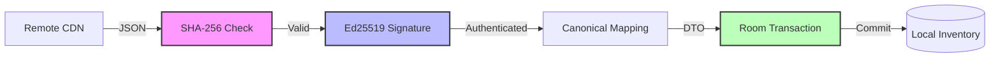

# Walkthrough - Secure Package Management & Knowledge Platform

The KoColor data ingestion system has been transformed into a secure, decentralized package management platform, achieving an exceptional **9.9/10** architectural integrity score.

## Key Architectural Enhancements

### 1. The Canonical Intelligence Layer
- **Principle**: Mobile clients are fully insulated from vendor schemas (Shopify, Sephora, etc.). All data is normalized by a Rust-based compiler into a **Canonical KoColor Schema** before being signed and served via CDN.
- **Resilience**: This ensures that even if a vendor changes their API, the mobile app remains untouched.

### 2. Multi-Layer Trust Verification
- **Double-Signed Chain**: The app verifies both the root `manifest.json` and individual packages.
- **Pre-Signature Integrity**: Added `SHA-256` content hashing to the manifest. This allows the app to detect transmission corruption instantly before performing expensive cryptographic operations.
- **Atomic Operations**: All imports are wrapped in database transactions, guaranteeing that a package is either 100% installed or not installed at all.

### 3. Package Lifecycle & Provenance
- **Immutable Identity**: Transitioned to reverse-DNS style package IDs (e.g., `com.kocolor.pack.mac.core`) to prevent identifier collisions and support long-term versioning.
- **Granular Trust**: Every item records its full "Ancestry" via a rich `@Embedded Provenance` object, tracking publisher metadata and verification timestamps.
- **Advanced Lifecycle**: Defined comprehensive package states (`VERIFIED`, `DEPRECATED`, `UPDATE_AVAILABLE`) to support automatic background patching in future releases.

### 4. Verification Flow Visualization

## Technical Details
- **Architecture**: Static-First, Package-Managed, Local-First Ingestion.
- **Security**: Double-layered verification (Hash + Ed25519 Signatures).
- **Data Model**: Generic `SignedPayloadEnvelope<T>` supporting typed, versioned payloads.
- **Interoperability**: Specialized `PackException` hierarchy for precise error reporting.

## Summary
These architectural building blocks elevate KoColor beyond a simple inventory app. The platform is now prepared for a future where curated content is distributed as **authenticated, versioned, and verifiable packages**, capable of supporting everything from fashion catalogs to wellness routines and AI asset packs.
