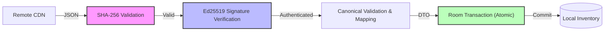

# Walkthrough - Secure Package Distribution Platform

The KoColor data ingestion system has been transformed into a secure, distributed package management platform. This architecture emphasizes deterministic data processing, cryptographic verification, provenance tracking, and complete client-side insulation from external vendor schemas.

## Key Architectural Enhancements

### 1. The Canonical Intelligence Layer
- **Architectural Principle**: Mobile clients are fully insulated from vendor-specific data formats (Shopify, Sephora, etc.). All data is normalized by a Rust-based compiler into the **Canonical KoColor Schema** before being signed and served via CDN.
- **Resilience**: This ensures that even if a vendor changes their API or JSON structure, the mobile, Wear OS, and XR applications remain untouched.

### 2. Multi-Layer Trust Verification
- **Double-Signed Chain**: The app verifies both the root `manifest.json` (the package index) and individual content packages.
- **Pre-Signature Integrity**: We implemented `SHA-256` content hashing. This allows the app to detect transmission corruption instantly before performing expensive cryptographic signature verification.
- **Atomic Persistence**: All imports are wrapped in strict database transactions. This guarantees a "BEGIN TRANSACTION → INSERT → COMMIT" flow, ensuring packages are either 100% installed or completely rolled back.

### 3. Package Lifecycle & Provenance
- **Immutable Identity**: Transitioned to reverse-DNS style package IDs (e.g., `com.kocolor.pack.mac.core`) to prevent collisions and support reliable long-term versioning.
- **Granular Trust**: Every item records its full "Ancestry" via a rich `@Embedded Provenance` object, tracking the `VerificationState` (VERIFIED, FAILED, LEGACY) rather than a simple boolean flag.
- **State Machine**: Defined a comprehensive package lifecycle (`AVAILABLE` → `VERIFIED` → `INSTALLED` → `DEPRECATED`), preparing the platform for automatic background updates and data patches.

### 4. Verification Flow Visualization

## Technical Details
- **Architecture Style**: Static-First, Package-Oriented, Local-First Architecture.
- **Security**: Dual-layered verification pipeline (Hash + Ed25519 Signatures).
- **Data Model**: Generic `SignedPayloadEnvelope<T>` supporting typed, versioned payloads.
- **Error Handling**: Specialized `PackException` hierarchy for precise diagnostic reporting.

## Summary
These architectural building blocks elevate KoColor beyond a traditional inventory application. The platform now provides a reusable package distribution system capable of delivering authenticated, versioned, and verifiable content across fashion, cosmetics, wellness, AI knowledge, and future digital experiences. Because every package conforms to the Canonical KoColor Schema, new content types can be introduced without changing the core mobile application architecture.
