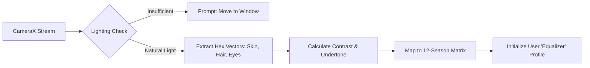

# Architecture Specification: Edge AI Phenotype Calibration

This specification defines the foundational onboarding pipeline for KoColor, utilizing on-device computer vision to securely establish the user's mathematical aesthetic baseline without relying on cloud-based image processing.

---

## 1. Biometric Ingestion & Local Processing

* **Lighting Validation Gate**: Before capture, the engine utilizes the device's ambient light sensor and camera exposure metrics to ensure the user is in natural lighting, preventing artificial yellow/blue color casting that would corrupt the undertone calculation.
* **On-Device Feature Extraction**: Utilizing Android's CameraX and a quantized TensorFlow Lite (or MediaPipe) model, the system maps facial landmarks to extract color hex codes from three specific zones: skin surface, iris, and natural hair root.
* **Zero-Cloud Privacy Guarantee**: The raw camera frames are processed entirely in memory on the edge device and immediately discarded. Only the abstracted mathematical vectors (undertone heat, contrast ratio, brightness) are persisted to the user's local Room database.

---

## 2. The Classification Pipeline



* **The Undertone & Brightness Matrix**: The mathematical model evaluates whether the skin pulls warm (yellow/peach) or cool (blue/pink), and measures the overall brightness (light vs. deep).
* **The Contrast Delta**: The engine calculates the difference in luminance between the skin, eyes, and hair. (e.g., Pale skin with black hair yields a "High Contrast" flag; olive skin with brown hair yields "Medium-Low Contrast").
* **12-Season Resolution**: The combined vectors map deterministically to one of the 12 seasonal palettes (e.g., *True Winter*, *Soft Summer*, *Deep Autumn*). This categorization dictates the color harmony rules for all future outfit generation and penalty matrices.

---

## 3. The "Equalizer" & Virtual Vanity Integration

* **The Aesthetic Baseline**: The established phenotype acts as the master "equalizer" for the V1 AI Styling Engine. If a garment's color mathematically clashes with the user's season, the engine dynamically calculates the required offset.
* **The Cosmetic Crossfade**: When a clash occurs, the engine queries the `CosmeticItemEntity` database (the Virtual Vanity) and recommends specific makeup shades (e.g., a warm-toned foundation and coral lip) to artificially bridge the gap between the user's natural phenotype and the clashing garment.

---

## 4. Core Domain Model

```kotlin
enum class ColorSeason {
    BRIGHT_SPRING, TRUE_SPRING, LIGHT_SPRING,
    LIGHT_SUMMER, TRUE_SUMMER, SOFT_SUMMER,
    SOFT_AUTUMN, TRUE_AUTUMN, DEEP_AUTUMN,
    DEEP_WINTER, TRUE_WINTER, BRIGHT_WINTER
}

data class FacialContrastVector(
    val skinLuminance: Float,
    val hairLuminance: Float,
    val eyeLuminance: Float,
    val contrastDelta: Float // Calculated difference
)

data class PhenotypeProfile(
    val season: ColorSeason,
    val undertone: Float, // -1.0 (Cool) to 1.0 (Warm)
    val contrastVector: FacialContrastVector,
    val optimalPaletteHexCodes: List<String>
)

```

---

With the Edge AI processing strategy locked, are you planning to train a custom quantized model for the color extraction, or utilize a pre-trained face mesh from Google's ML Kit to isolate the zones before doing standard Android bitmap color sampling?