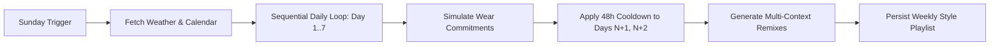

# Architecture Specification: 7-Day Style Forecasting Engine (Discover Weekly)

This specification defines the multi-day planning engine for KoColor, transforming raw calendar and meteorological data into an automated 7-day style playlist.

---

## 1. Ingestion & Context Normalization

* **Weather Ingestion**: Ingests a 7-day forecast (temperature range, precipitation probability, humidity) to establish hard thermal bounds and fabric-safety filters (e.g., penalizing suede, silk, or open-toe shoes during rain).
* **Calendar Intent Classifier**: Scans synced calendar events via the device Calendar Provider, transforming unstructured event strings into structured context tags (e.g., "Board Review" $\rightarrow$ `[Context: Formal Work]`, "Saturday Bouldering" $\rightarrow$ `[Context: Active]`).

---

## 2. The Sequential 7-Day Planning Pipeline



* **Simulated State Forwarding**: The engine processes days sequentially (Monday $\rightarrow$ Sunday). When an item is selected for Day $N$, the engine writes a *simulated usage event* into an in-memory rotation state, instantly enforcing the 48-hour hard cooldown and frequency penalties across Days $N+1$ and $N+2$.
* **V1 Logic Gate Integration**: The candidate item pool for each day must pass through the formality and thermal penalty matrices before the AI selects the final outfit and cosmetic pairing.
* **Contextual Daylist Remixes**: For days with multiple distinct calendar tags (e.g., Work followed by Night Out), the engine generates a base outfit with a low-friction "Remix" delta (e.g., jacket removal, footwear swap, and a bold lip color shift) instead of two disconnected outfits.

---

## 3. Dynamic Invalidation & Reactive Sync

* **Scheduled Batch Execution**: A background `CoroutineWorker` schedules the weekly generation run every Sunday morning, populating the Planner screen.
* **Forecast Delta Invalidation**: If the weather forecast for an upcoming scheduled day shifts significantly (e.g., rain probability increases by $\ge 40\%$), the engine recalculates only that specific day's playlist and notifies the user.

---

## 4. Core Domain Model

```kotlin
data class DailyStylePlan(
    val date: LocalDate,
    val weatherContext: WeatherCondition,
    val primaryContext: LifestyleContext,
    val baseOutfit: OutfitManifest,
    val eveningRemix: RemixDelta? = null,
    val cosmeticCrossfade: CosmeticPalette
)

data class WeeklyStylePlaylist(
    val weekStartDate: LocalDate,
    val days: List<DailyStylePlan>,
    val projectedWardrobeUtilization: Float
)

```

---

Which weather provider API are you planning to integrate for the 7-day forecast data layer?