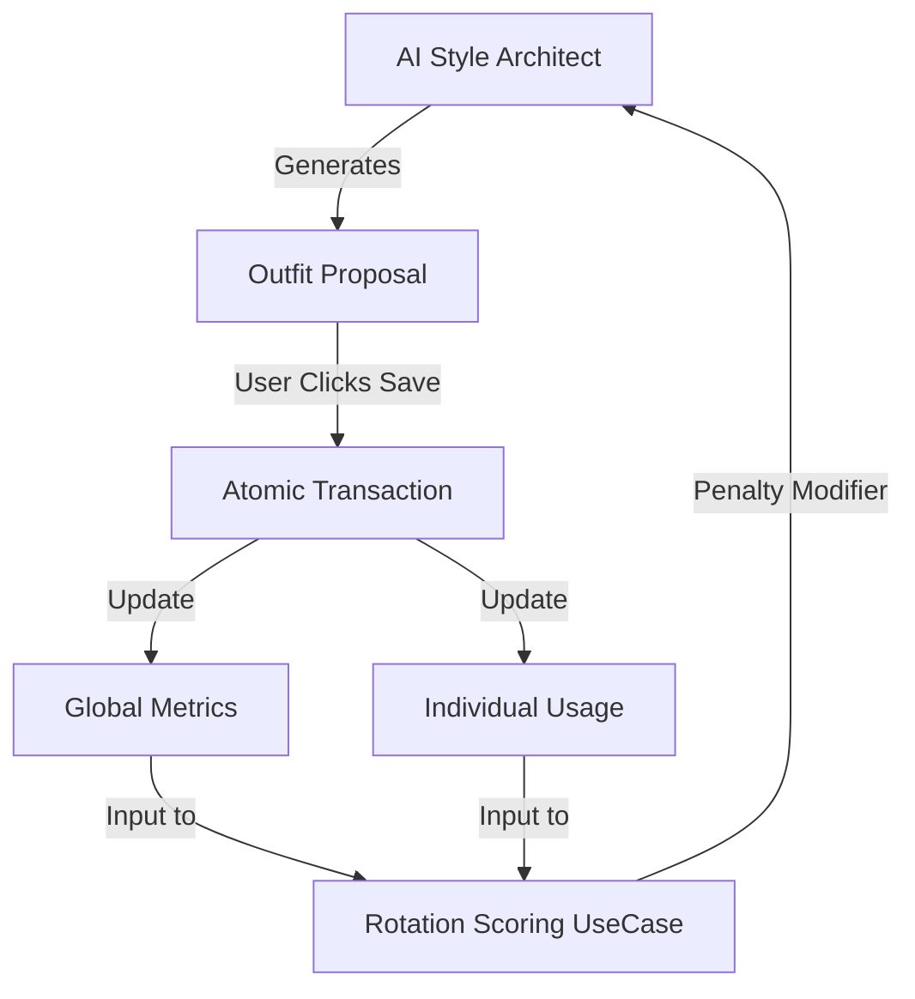

# Walkthrough: Intelligent Category-Aware Clothing Rotation (V1 Locked)

This document provides a technical walkthrough of the KoColor Clothing Rotation System, tracing the lifecycle of data from an AI styling recommendation to a permanent user commitment.

## 1. System Overview

The rotation system is a **Closed-Loop Feedback Engine**. It observes user selections and feeds those observations back into the styling engine as a negative pressure (penalty) to ensure wardrobe diversity.

---

## 2. Phase 1: The Styling Request (The Input)

When a user requests a new outfit, the `StyleSimulatorViewModel` prepares a "Minified Manifest" for the AI.

1.  **Metric Aggregation**: The `RotationScoringUseCase` evaluates each candidate against the aggregated usage state for the relevant category. It avoids N+1 query traps by joining the usage data with canonical category metadata at the DAO level.
2.  **Scoring Logic**:
    *   **Cold Start Rule**: If the user has committed fewer than 5 outfits, the penalty is forced to `0.0`.
    *   **Frequency Penalty**: Calculated as `Item_Use_Count / Total_Category_Use_Events`. If this "Share" exceeds 35%, a high penalty is applied.
    *   **Recency Penalty**: If the item was used in the last **48 hours**, a maximum penalty of `1.0` is applied.
3.  **The AI Prompt**: The final penalty [0.0 to 1.0] is injected into the matrix sent to the LLM.
    *   *Example*: `["w_101", "silk blouse", "#FFFFFF", "1", "0.85"]` (The `0.85` tells the AI this item is "stale").

---

## 3. Phase 2: The Outfit Commitment (The Save)

When the user clicks "SAVE TO PALETTE", the system must record this event with absolute precision using `database.commitOutfitUsage(ids)`.

### The Atomic Transaction (`commitOutfitUsage`)
Updating history involves multiple tables and must succeed or fail as a single unit using `database.withTransaction {}`.

1.  **Global Update**: The `global_rotation_metrics` table is updated. `totalOutfitsCommitted` increments by 1.
2.  **Deduplication**: The repository applies a `.distinct()` filter to the `selectedProductIds` list prior to the Room update sequence. If the outfit contains duplicate IDs (e.g., matching socks), the system ensures an item only gets +1 use per outfit.
3.  **Personalization Update**: For each unique product in the outfit, the `ClothingUsageEntity` is updated or created:
    *   `useCount` += 1.
    *   `lastUsedTimestamp` = current_time.

> [!TIP]
> **Reactive UI Observation**: Because the Jetpack Compose UI observes the Room database via `StateFlow`, the "Wear Count" badges on the garment cards will automatically increment the moment the atomic transaction commits, requiring zero manual UI invalidation.

---

## 4. Phase 3: The Data Separation (Integrity)

We maintain a strict boundary between "What an item IS" and "How you USE it". The rotation layer perform a join on `productId` to apply the KCPS taxonomy to the personal analytics.

| Feature | `ClothingItemEntity` (Canonical) | `ClothingUsageEntity` (Personal) |
| :--- | :--- | :--- |
| **Source** | Signed KCPS Vault (CDN) | Local user behavior |
| **Data Points** | `productId`, `category`, `color` | `productId`, `useCount`, `lastUsedTimestamp` |
| **Update Frequency** | Rare (Release cycles) | Frequent (Every outfit save) |
| **Reset Logic** | Wipe/Re-sync | Survives catalog updates |

---

## 5. Verification Highlights

### The 48-Hour Hard Window
If you wear your favorite "Obsidian Moto Jacket" on Monday at 10:00 AM, the system will apply a maximum `1.0` recency penalty until Wednesday at 10:00 AM. This ensures the AI looks for alternatives in your Outerwear category for the next two days.

### The Proportional Share
If you have 10 TOP usage events and one specific "White Shirt" accounts for 4 of them, that shirt has a **40% Category Share**. Since this exceeds our `0.35` (35%) threshold, the AI will apply a frequency penalty to suggest your other tops, rebalancing your style.
