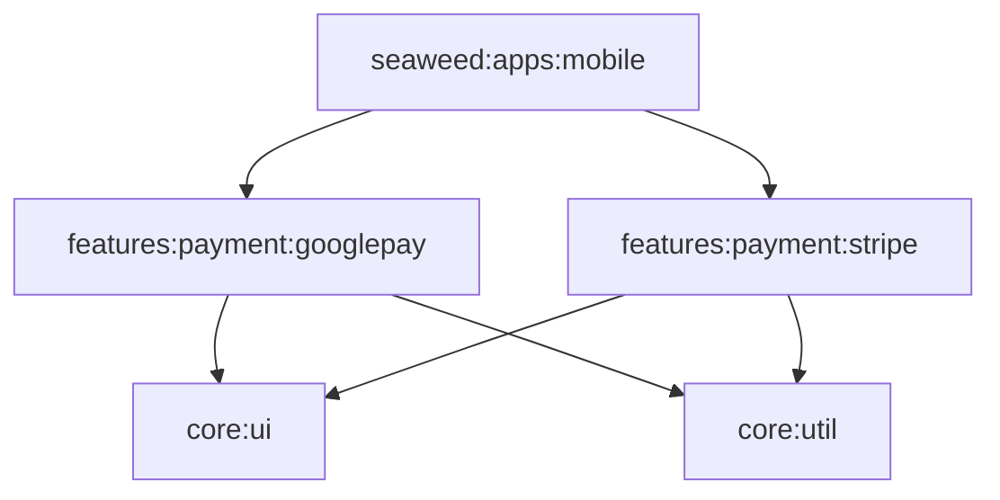

# Feature: Payment (Modular Infrastructure)

This walkthrough details the construction of the `:features:payment` module, designed to provide a reusable, isolated, and scalable infrastructure for handling financial transactions across the ProBase ecosystem.

## 1. Modular Architecture

Following the pattern of `:features:ai`, the payment feature is architected as a top-level feature container with specific provider sub-modules.

- **`:features:payment:googlepay`**: specialised sub-module for Google Pay logic and UI.
- **`:features:payment:stripe`**: specialized sub-module for Stripe integration using the modern `PaymentSheet` flow.
- **Independence**: The module is completely decoupled from the Seaweed app logic, making it easily consumable by other products like AshBike or Photodo.

## 2. Google Pay Integration (POC)

The initial implementation focuses on a high-polish Google Pay proof-of-concept.

### Infrastructure & Config
- **Play Services Wallet**: Integrated the official `play-services-wallet` library for API handshakes.
- **Manifest Orchestration**: Configured the global `AndroidManifest.xml` to enable the Google Pay API at the application level.
- **JSON Security**: Encapsulated the complex `allowedPaymentMethods` JSON configurations within the feature module to prevent leakages into app-level code.

### Reusable UI Components
- **`SeaweedGooglePayButton`**: A pre-styled, brand-compliant Google Pay button.
- **`rememberSeaweedStripeLauncher`**: A Compose-friendly utility to launch the Stripe PaymentSheet.

## 3. Integration with Seaweed "Smart Buy"

The Seaweed app acts as the first consumer of this reusable feature.

- **Add Transaction Screen**: Integrated the payment button within a new **"Smart Purchase Guidance"** section.
- **AI Guardrails**: Wired the flow to support future AI verification, where the LLM can analyze the purchase against current budgets before the Google Pay sheet is even opened.

---

## 4. Technical Specifications

### New Dependencies
Added to `libs.versions.toml`:
- `google-play-services-wallet`
- `google-pay-button-compose`
- `stripe-android`

### Dependency Graph

## 5. Verification Summary

### Automated Verification
- **Gradle Sync**: Completed successfully for the new module.
- **Build Pass**: A full project build was performed to ensure that the cross-module dependency between `:apps:mobile` and `:features:payment:googlepay` is stable.

### Manual Testing Path
1. **Navigation**: Navigate to "Add Transaction" in Seaweed.
2. **Visual Check**: Verify the Google Pay button appears with correct "Buy with G Pay" branding.
3. **Trigger**: Tap the button to verify the "Save Transaction" callback (POC state) is correctly invoked.
