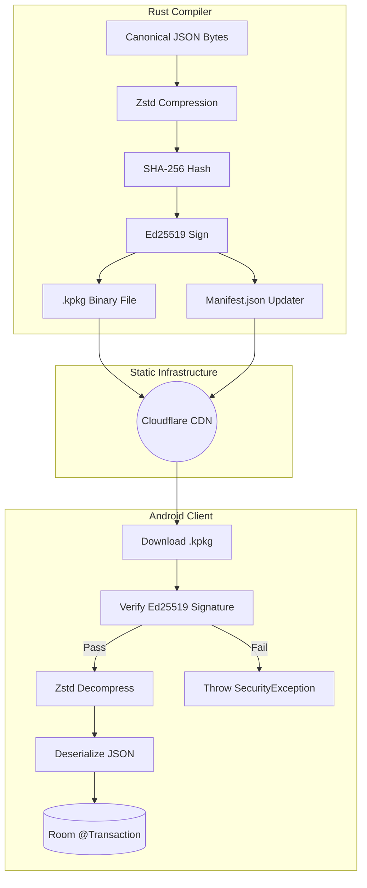

Here is the definitive architectural and operational guide for building Phase 1.

You can save this directly into your repository's `docs/` folder as `PHASE_1_STATIC_PIPELINE.md`.

---

# Phase 1: The Static-First Compression Pipeline (Zstd + Ed25519)

This document details the exact implementation path for migrating the KoColor Secure Package Distribution Platform from plaintext JSON payloads to highly compressed, cryptographically signed binary packages (`.kpkg`).

This architecture maintains a **$0-budget static infrastructure**. It requires no dynamic servers, KMS, or live backend compute, operating entirely via Rust build-time compilation and Android on-device verification.

## 1. Architectural Objectives

1. **Bandwidth Optimization:** Compress heavy canonical payloads using Zstandard (zstd) to reduce CDN egress costs and accelerate mobile ingestion.
2. **Zero-Trust Security:** Calculate SHA-256 hashes and Ed25519 signatures strictly against the *compressed* binary sequence.
3. **Public Cataloging:** Maintain `manifest.json` in plaintext to power the Glow Sync Hub UI and search indexes without forcing the client to download massive data payloads first.
4. **Static Isolation:** Ensure the CDN remains a pure, dumb file host (Cloudflare Pages/R2).

---

## 2. The Rust Compiler Implementation (`kocolor-compiler`)

The Rust compiler is responsible for aggregating data, applying compression, signing the output, and writing the final `.kpkg` binaries.

### A. Dependencies

Update `Cargo.toml` to include the Zstandard compression library:

```toml
[dependencies]
zstd = "0.13" # Adds Zstandard compression
serde = { version = "1.0", features = ["derive"] }
serde_json = "1.0"
ed25519-dalek = "2.0"
sha2 = "0.10"
hex = "0.4"

```

### B. The Transformation Pipeline

The compiler's `main.rs` must execute operations in this exact order to prevent signature mismatches:

1. **Serialize DTOs:** Convert the `CanonicalPackItem` vector into a minified JSON string (`serde_json::to_vec`).
2. **Compress:** Stream the JSON bytes through a Zstd encoder.
```rust
let compressed_bytes = zstd::stream::encode_all(json_bytes.as_slice(), 3).unwrap();

```


3. **Hash:** Calculate the SHA-256 digest of the `compressed_bytes`.
4. **Sign:** Generate the Ed25519 signature of the `compressed_bytes`.
5. **Output:** Write the `compressed_bytes` to disk as `[package_id].kpkg`.
6. **Manifest:** Write the plaintext `manifest.json`, ensuring the `sha256` and `signature` fields map to the `.kpkg` file, and include UI metadata (`thumbnail_url`, `search_tags`).

---

## 3. The Android Client Implementation (`:features:starterpack`)

The Android application acts as a Zero-Trust Receiver. It intercepts the binary stream, verifies the cryptography, decompresses the payload in memory, and persists it.

### A. Dependencies

Update `build.gradle.kts` to include the Zstandard JNI bindings:

```kotlin
dependencies {
    // Cryptography
    implementation("org.bouncycastle:bcprov-jdk18on:1.77")
    // Fast native Zstandard decompression
    implementation("com.github.luben:zstd-jni:1.5.5-4")
}

```

### B. Network Layer adjustments

Modify the Retrofit `KocolorApiService` to handle raw binary downloads for packages, rather than attempting automatic JSON deserialization.

```kotlin
@GET("packs/{packId}.kpkg")
suspend fun downloadPackageBinary(@Path("packId") packId: String): ResponseBody

```

### C. The Verification & Ingestion Pipeline

In `StarterPackRepositoryImpl.kt`, enforce the **Verify-First Rule**. Never decompress a byte array that has not been cryptographically authenticated.

1. **Fetch Manifest:** Download the plaintext `manifest.json`.
2. **Stream Binary:** Download the `.kpkg` file as a raw `ByteArray`.
3. **Verify Integrity:** Hash the `ByteArray` and check it against the manifest's SHA-256 string. Fast-fail if mismatched.
4. **Verify Authenticity:** Pass the `ByteArray` to the BouncyCastle `Ed25519Signer`. Fast-fail if the signature is invalid.
5. **Decompress:**
```kotlin
val decompressedBytes = Zstd.decompress(verifiedByteArray, originalSizeLimit)
val jsonString = String(decompressedBytes, Charsets.UTF_8)

```


6. **Deserialize & Persist:** Parse `jsonString` into `CanonicalPackItem` data classes and insert them into the Room database inside an atomic `@Transaction`.

---

## 4. Security & Safety Invariants

* **Zip Bomb Protection:** By strictly verifying the Ed25519 signature *before* invoking `Zstd.decompress`, the app is immune to malicious actors swapping a legitimate `.kpkg` file on the network with a highly compressed "zip bomb" designed to crash the device's memory.
* **Deterministic Output:** Ensure the Rust compiler does not inject timestamps or unpredictable metadata into the JSON payload before compression, guaranteeing reproducible hashes.
* **Key Isolation:** The Android app only ships with `KOCOLOR_ROOT_PUBLIC_KEY`. The private key remains entirely local to the compiler environment.

## 5. Flow Diagram

