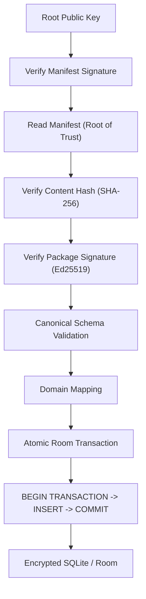

# Implementation Plan - Secure Package Distribution Platform

The KoColor platform distributes structured content through a secure, package-oriented architecture. External product data is normalized, authenticated, versioned, and delivered as canonical KoColor packages, allowing client applications to consume trusted content without depending on vendor-specific schemas.

## Core Design Principles

### 1. Canonical Data Layer
> [!IMPORTANT]
> **The Canonical Model Rule**: All external product data is transformed into the Canonical KoColor Schema before distribution. Client applications consume only the Canonical KoColor Schema and never depend on vendor-specific formats (e.g., Shopify, Sephora) directly.

### 2. Deterministic Processing
> **Principle**: Given identical source data and the same compiler version, the Rust Normalization Compiler must always generate identical canonical packages.

### Trust Verification Flow (Root of Trust)

## User Review Required

- **Reverse-DNS Identifiers**: All package IDs use immutable strings (e.g., `com.kocolor.pack.mac.core`) to ensure identity persistence.
- **Atomicity Enforcement**: All import operations are wrapped in strict `@Transaction` blocks.
- **Schema Evolution Protection**: We use distinct `packageVersion` (content release) and `schemaVersion` (structure definition).

## Final State Changes

### [Data Layer - Room Database]

#### [MODIFY] [Provenance.kt](file:///Users/developer/AndroidStudioProjects/ProBase/applications/kocolor/db/src/main/java/com/zoewave/probase/kocolor/db/entity/Provenance.kt)
- **States**: Transitioned to `VerificationState` enum: `VERIFIED`, `FAILED`, `UNKNOWN`, `LEGACY`.
- **Identity**: Enforced immutable `packId` using reverse-DNS naming.
- **Invariants**: Provenance is immutable after installation.

#### [MODIFY] [CosmeticItemEntity.kt](file:///Users/developer/AndroidStudioProjects/ProBase/applications/kocolor/db/src/main/java/com/zoewave/probase/kocolor/db/entity/CosmeticItemEntity.kt)
- Ensure `@Embedded(prefix = "provenance_") val provenance: Provenance?` is indexed.

#### [NEW] [PackStatus.kt]
- **State Machine**: `AVAILABLE` → `DOWNLOADING` → `VERIFIED` → `INSTALLED` → `UPDATE_AVAILABLE` → `DEPRECATED`.

---

### [Data Layer - Network & DTOs]

#### [MODIFY] [SignedPayloadEnvelope.kt](file:///Users/developer/AndroidStudioProjects/ProBase/applications/kocolor/features/starterpack/src/main/java/com/zoewave/probase/kocolor/features/starterpack/data/remote/model/SignedPayloadEnvelope.kt)
- Support dual-versioning: `packageVersion: String` and `schemaVersion: Int`.
- **Zero-Trust**: Use `JsonElement` for the `data` field to preserve raw bytes for signature verification.

---

### [Repository Layer - Verification Pipeline]

#### [MODIFY] [StarterPackRepository.kt](file:///Users/developer/AndroidStudioProjects/ProBase/applications/kocolor/features/starterpack/src/main/java/com/zoewave/probase/kocolor/features/starterpack/data/StarterPackRepository.kt)
- **BouncyCastle Integration**: Cryptographic verification of Ed25519 signatures.
- **Verification Chain**:
    1. SHA-256 Validation
    2. Ed25519 Signature Verification
    3. Canonical Schema Validation
    4. Domain Mapping
- **Atomicity**: Bulk insertion within Room transactions.

---

### [UI Layer]
- **Sync Hub**: Material 3 `DockedSearchBar` with debounced filtering.
- **Selective Picker**: `LazyColumn` with auto-scroll and highlight logic for targeted items.
