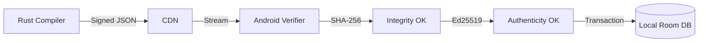

# Walkthrough - Secure Package Distribution Platform

The KoColor data ingestion system has been successfully transformed into a secure, distributed package management platform. This walkthrough outlines the end-to-end flow from package generation to verified local persistence.

## 1. The Canonical Data Pipeline

### Step 1: Rust Normalization Compiler
External vendor data (e.g., Shopify JSON) is sucked into the Rust-based compiler. It is stripped of non-essential metadata and mapped into the **Canonical KoColor Schema**.
- **Outcome**: A deterministic, structured package payload.

### Step 2: Cryptographic Signing
The compiler calculates a **SHA-256** hash of the payload and signs it using an **Ed25519** private key.
- **Outcome**: A `SignedPayloadEnvelope` containing the data, hash, signature, and versioning metadata.

## 2. Zero-Trust Android Receiver

### Step 3: Global Discovery (Sync Hub)
The Android app fetches the root `manifest.json`. It verifies the manifest signature against the hardcoded **Root Public Key** before displaying available packages in the Glow Sync Hub.
- **Outcome**: A secure index of authenticated content.

### Step 4: Selective Ingestion (The Picker)
Users browse package contents (loading low-res thumbnails) and select items for import.
- **Auto-Scroll**: Search results deep-link directly to items using `animateScrollToItem`.
- **Highlighting**: Targeted items briefly pulse to provide immediate visual feedback.

### Step 5: The Verification Pipeline (BouncyCastle)
When "Import" is clicked, the app performs a three-stage validation:
1. **Integrity**: Compares the calculated SHA-256 of the raw network bytes against the manifest.
2. **Authenticity**: Verifies the Ed25519 signature using BouncyCastle.
3. **Compatibility**: Enforces `schema_version >= 2`.

### Step 6: Atomic Persistence (Room)
Validated items are mapped to domain models and inserted into the Room database within a strict `@Transaction` block.
- **Provenance**: Every item is tagged with immutable metadata (Publisher, Timestamp, Verification State).
- **Asset Pre-fetching**: Full-resolution images are downloaded asynchronously only after the database commit.

## Trust Flow Summary

## Technical Achievements
- **Zero-Trust**: No data is persisted without cryptographic proof.
- **Atomic**: No partial package imports; all-or-nothing consistency.
- **Insulated**: Mobile app is 100% decoupled from vendor API changes.
- **Scalable**: Unified infrastructure for fashion, cosmetics, and AI content.
